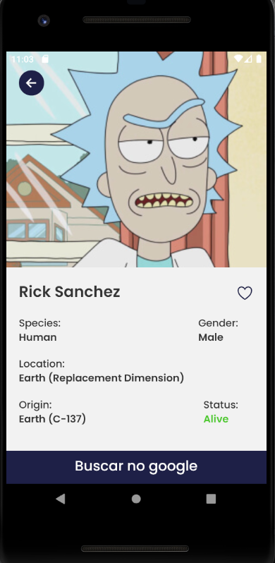

# rickmortywiki :books:

## A rick morty wikipedia





## Technologies :rocket:

- React Native
- Typescript
- Styled-Components
- Axios
- React Context
- React Navigation

## How to run

#### clone the repository
```bash
git clone https://github.com/johelder/rickmortywiki.git
```

#### install depedencies
```bash
yarn
```

#### run Metro
```bash
yarn start
```

#### finally, run to install the app on your device/virtual device
```bash
yarn android
```
